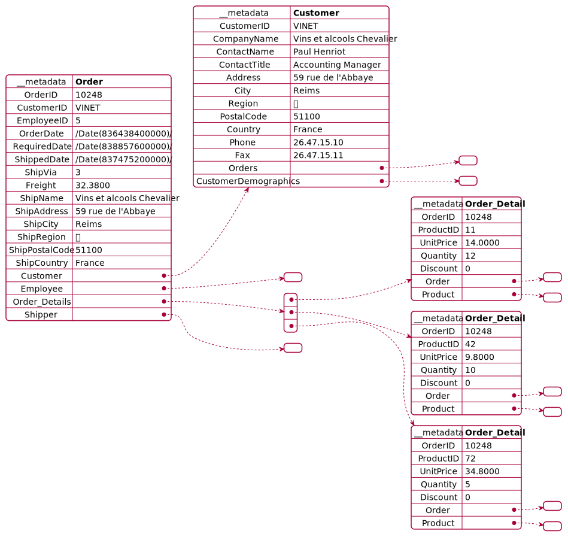

# Getting Started

Welcome to a small SAP CAP demo (@sap/cds).

This demo showcases the rendering of JSON diagrams with [PlantUML](https://plantuml.com/de/).

The demo renders a SVG from given JSON string using plantuml.jar executed via command line.

It contains these folders and files, following our recommended project layout:

The app is created with CDS init and follows the best practise

File or Folder | Purpose
---------|----------
`app/` | content for UI frontends goes here <not used>
`db/` | your domain models and data go here <not used>
`srv/` | your service models and code go here
`package.json` | project metadata and configuration
`readme.md` | this getting started guide

## Info
PlantUML offers a diagrams-as-code approach, where images are created from a textuell representation.
There are simliar projects and you can find an intro here
https://dev.to/simonbrown/diagrams-as-code-20eo

## Prerequisites

For local testing, the destinations need to be locally available!
Since sharing credentials in a git repo is a bad idea in general, please copy the template 

```cp tpl-default-env.json default-env.json```

to the used one, because this file is used by cap and ignored from git.
The northwind example will work out-of-the-box. 
The s4hana destination is only for demonstration, how to enter auth credentials for destinations.

**default-env.json**
```json
{
    "VCAP_SERVICES": {},
    "destinations": [
        {
            "name": "northwind",
            "url": "https://services.odata.org/V2/Northwind/Northwind.svc"
        },
        {
            "name": "s4hana",
            "url": "http://s4hana.system.de:8000/sap/opu/odata/sap/API_PRODUCT_SRV",
            "path": "/sap/opu/odata/sap/API_PRODUCT_SRV",
            "username": "<username>",
            "password": "<password>"
        }
    ]
}
```

## Next Steps
- Open a new terminal and run `cds watch` 
- (in VS Code simply choose _**Terminal** > Run Task > cds watch_)

## Plain Test 
Just render an inline object using 

http://localhost:4004/plantuml/renderTest()


## Northwind service rendering Order 

http://localhost:4004/plantuml/renderNorthwindOrder(OrderID=10248)



## Visual Studio Code Demo
If you are using Microsoft Visal Studio Code and the REST Client Extension humao.rest-client,
there is a test folder with an example how to trigger render directly from extension.

To be able to externalize credentials (and maybe also host).

**env.json**
```
User=xxx
Password=xxx
```

## Learn More

Learn more at https://cap.cloud.sap/docs/get-started/.
